# Evidências da Parte Prática

Prints que comprovam o sistema funcionando.

## Base de dados (3 tabelas, relacionamento N:N)

### Tabela Beneficiários — Idade calculada por fórmula
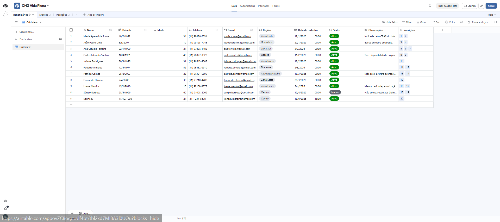

### Tabela Eventos
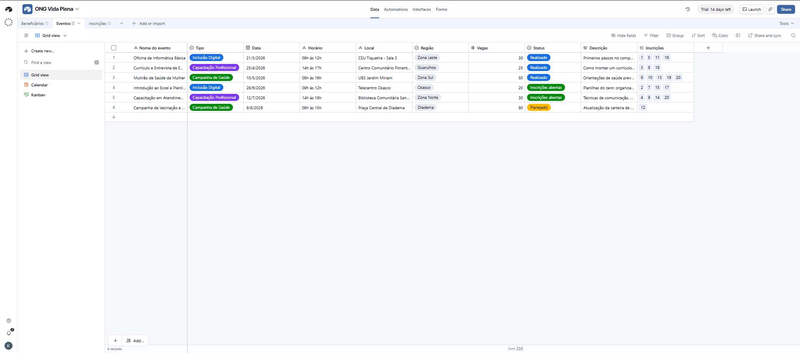

### Tabela Inscrições — ID automático e links (junção N:N)
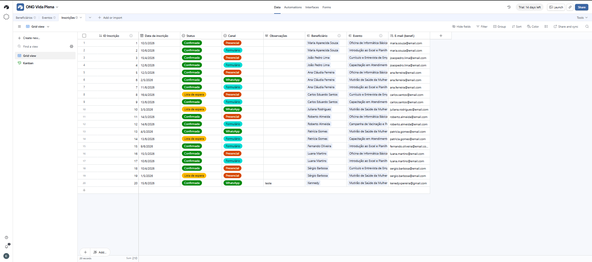

### Histórico de um beneficiário (N:N)
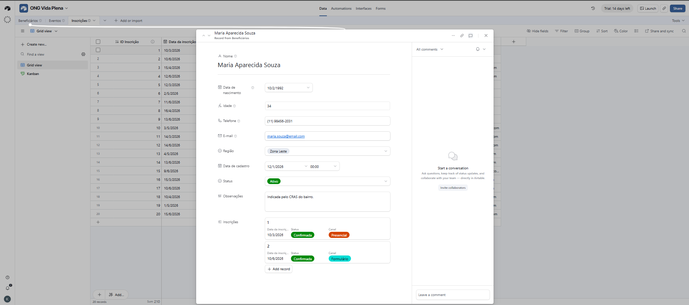

### Visualizações de eventos — Calendário e Kanban
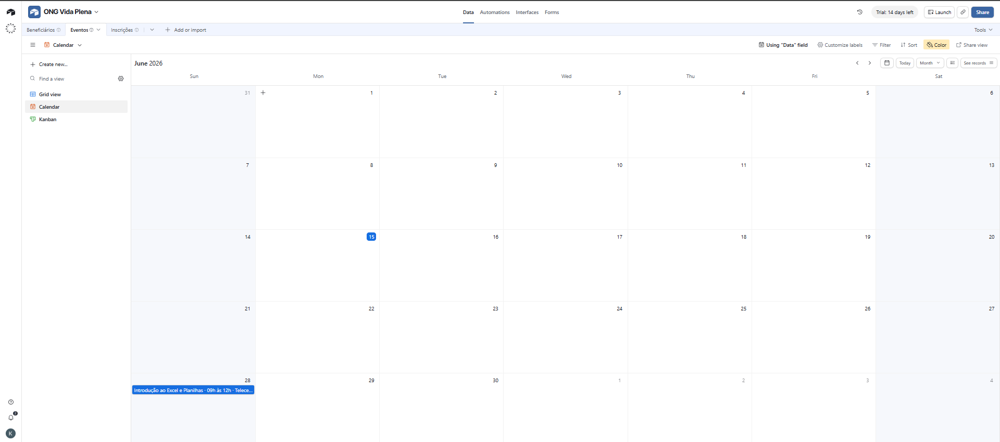
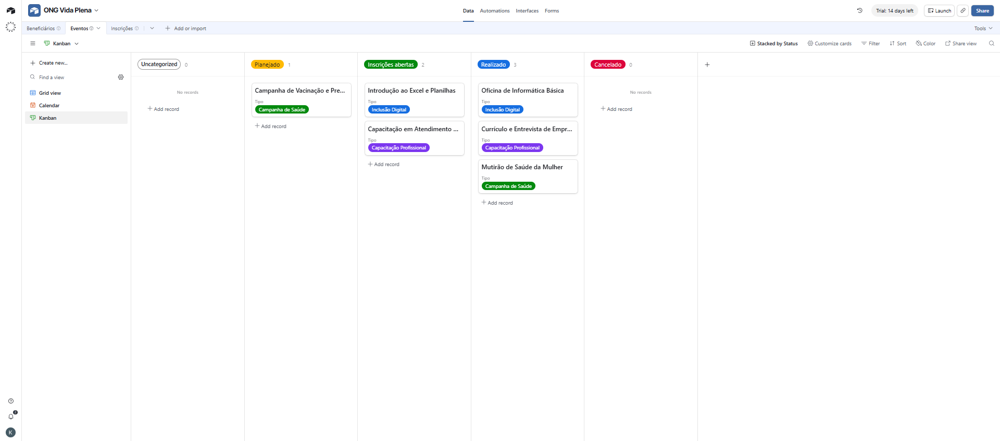

## Formulários (abertos no navegador)

### Cadastro de Beneficiário
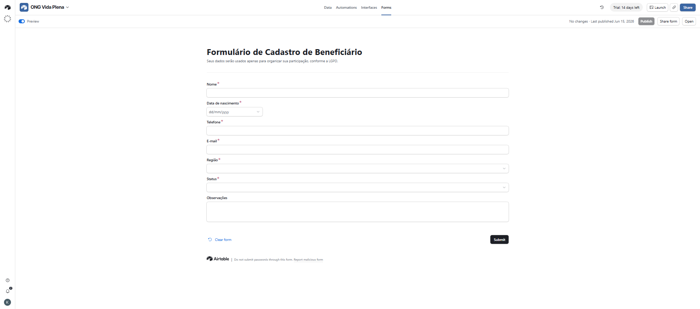

### Cadastro de Evento
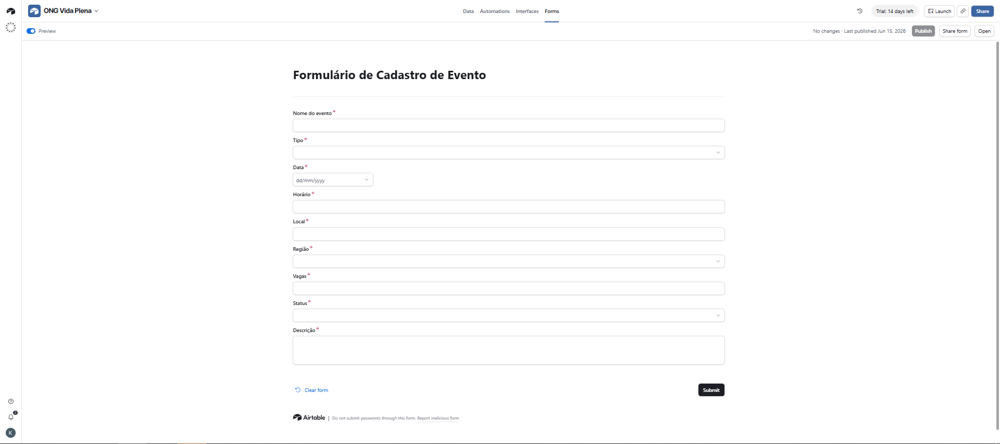

### Inscrição em Evento
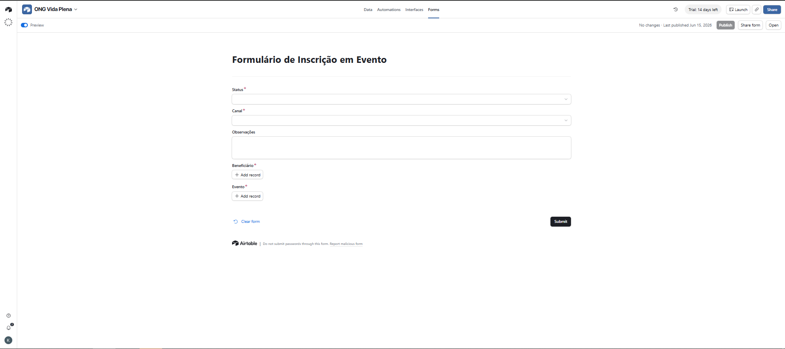

## Automações de e-mail (configuração)

### Nova inscrição
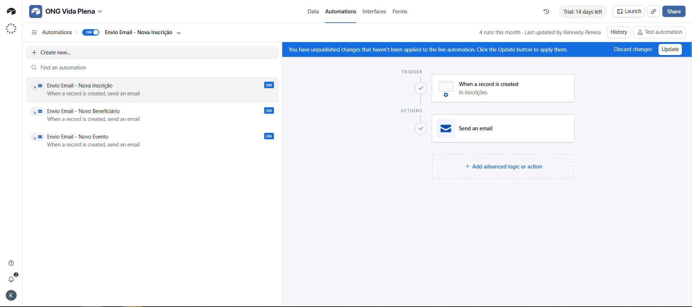

### Novo beneficiário
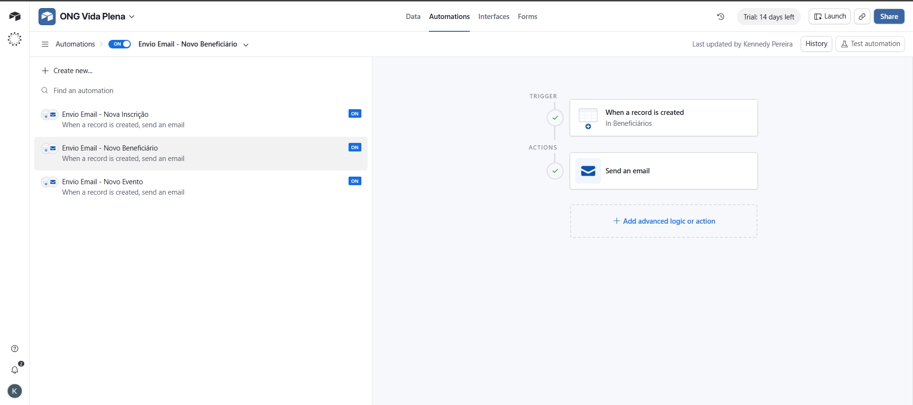

### Novo evento
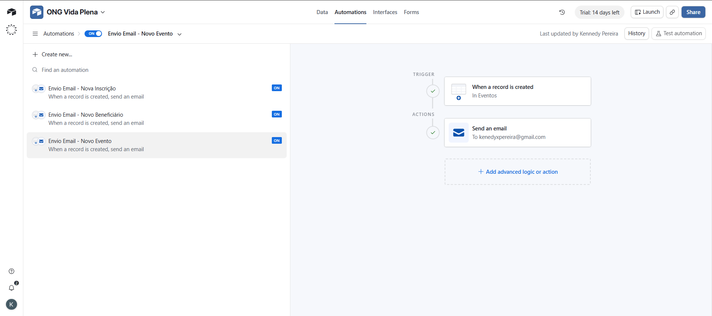

## Prévia dos e-mails (Generate a preview do Airtable)

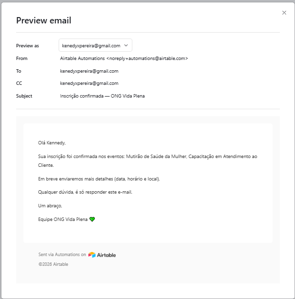
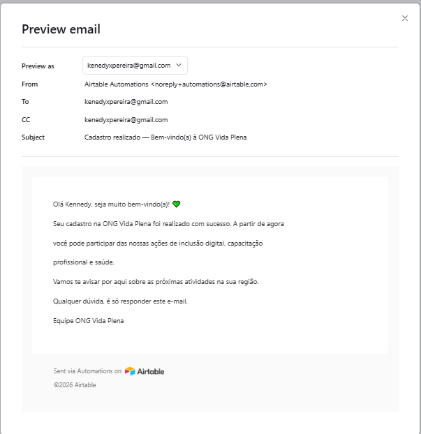
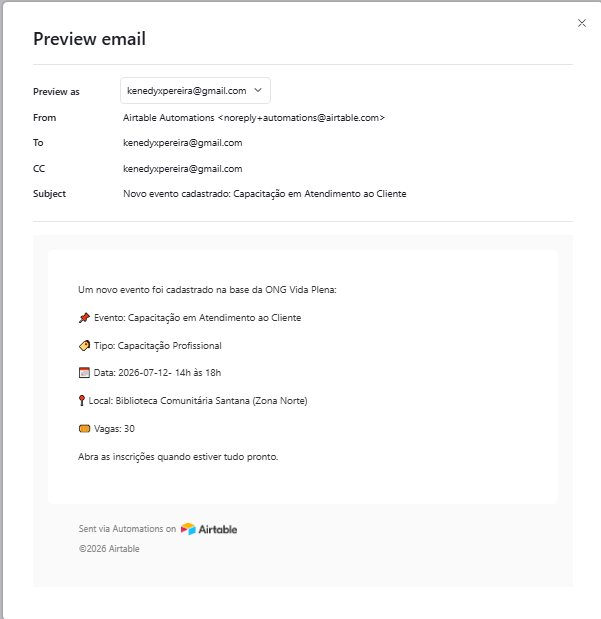

## E-mails recebidos na caixa de entrada

### Confirmação de inscrição
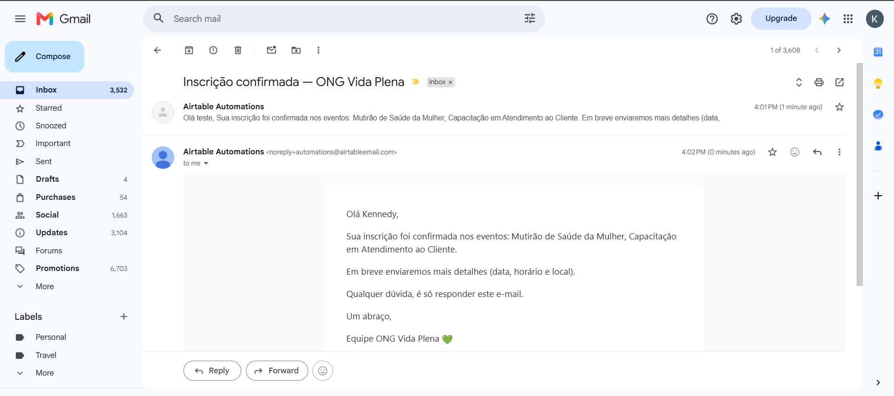

### Cadastro de beneficiário
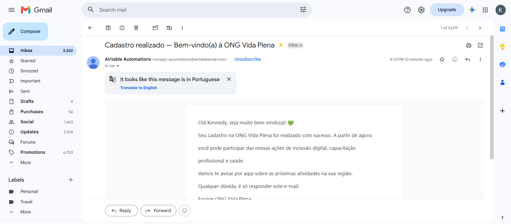

### Novo evento
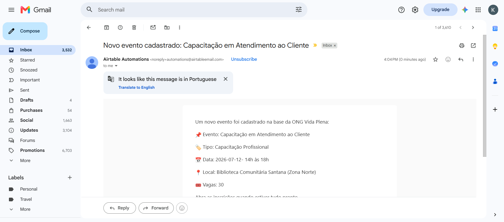

### Caixa de entrada com os 3 e-mails
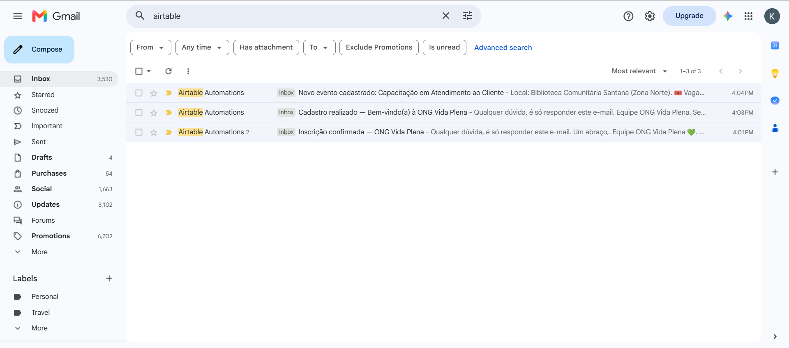

## Dashboard (Interface "Painel Vida Plena")

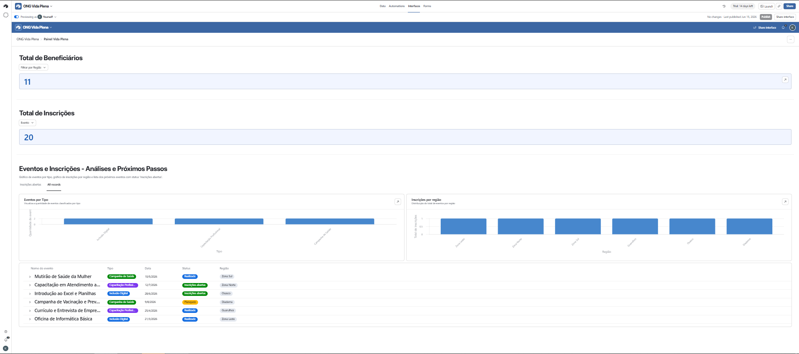
